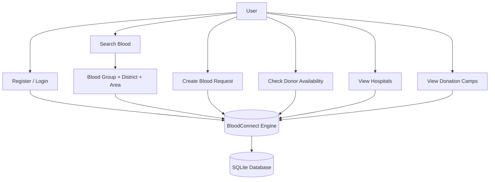
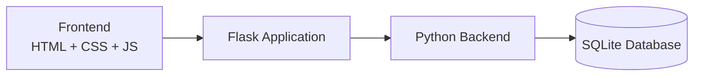
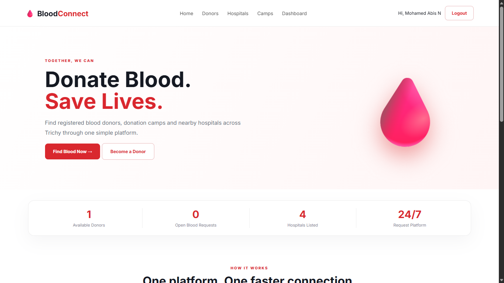
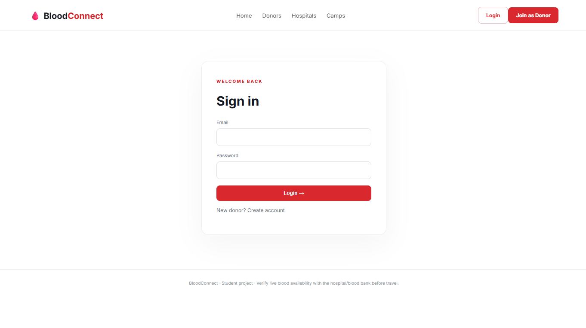
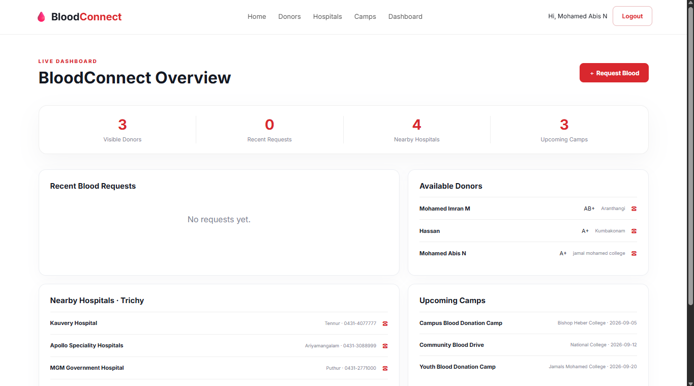
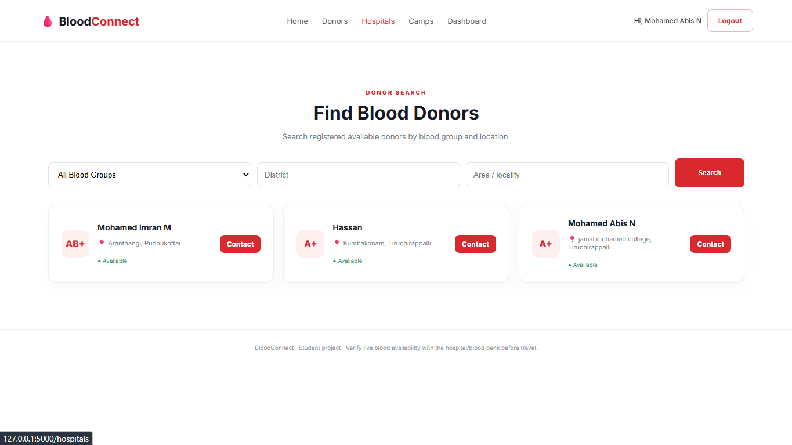
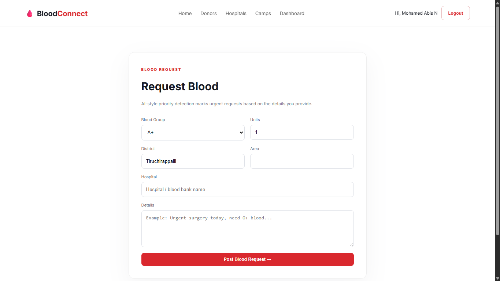
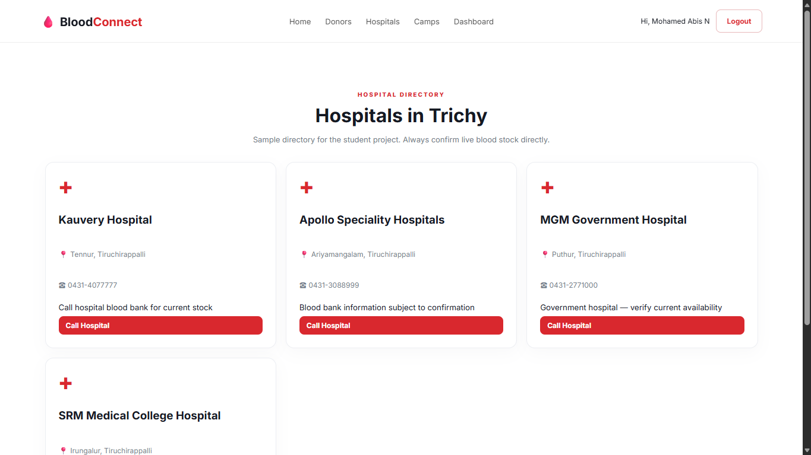
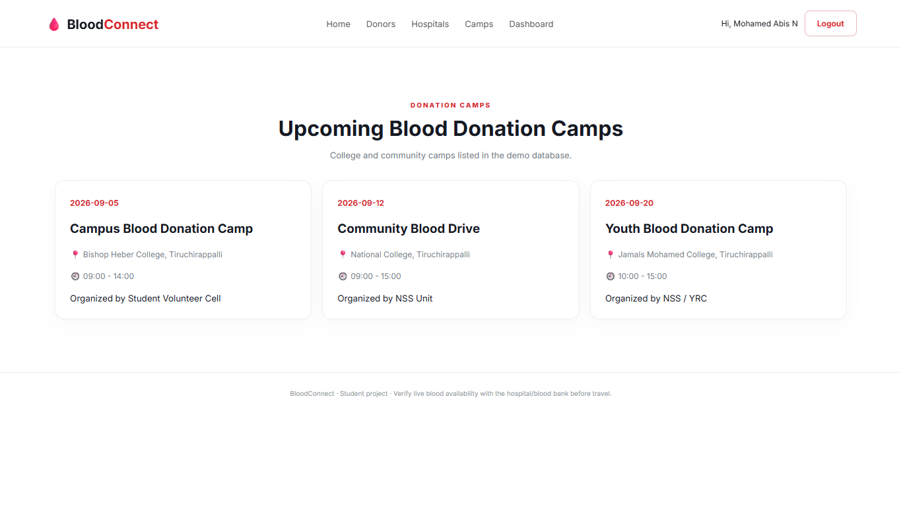

<div align="center">

# 🩸 BloodConnect

### Trichy Blood Donation Network

**A full-stack web platform connecting blood donors with people in urgent need — built end-to-end with Flask and SQLite.**

[](https://www.python.org/)
[](https://flask.palletsprojects.com/)
[](https://www.sqlite.org/)
[](#)
[](#)
[](#-license)

**[Live Demo](#-installation) · [Features](#-key-features) · [Screenshots](#️-application-screenshots) · [Installation](#️-installation) · [Author](#-author)**

</div>

<br>

> **🎓 BCA Final Year Project** · Domain: Healthcare / Social Impact

BloodConnect is a centralized web platform for donor registration, blood requests, donor discovery, hospital information, donation camps, and emergency-oriented request management — purpose-built for the Trichy region.

<br>

## 📖 Table of Contents

- [Objectives](#-objectives)
- [Key Features](#-key-features)
- [How It Works](#-how-bloodconnect-works)
- [Technology Stack](#️-technology-stack)
- [Architecture](#️-project-architecture)
- [Project Structure](#-project-structure)
- [Screenshots](#️-application-screenshots)
- [Installation](#️-installation)
- [Database](#️-database)
- [Data & Safety Note](#-data--safety-note)
- [Future Improvements](#-future-improvements)
- [Learning Outcomes](#-learning-outcomes)
- [Author](#-author)

<br>

## 🎯 Objectives

- Connect blood donors with people who need blood
- Simplify donor discovery with blood group and location filters
- Enable self-service donor registration
- Enable users to raise and track blood requests
- Surface donor availability information
- Centralize hospital information
- Publicize blood donation camps
- Provide an emergency-oriented dashboard
- Persist all application data in SQLite

<br>

## ✨ Key Features

<table>
<tr>
<td width="50%" valign="top">

### 🩸 Donor Registration
Users register as blood donors by submitting their details through a guided form.

### 🔐 Secure Login
Registered users log in to access the full application.

### 🔎 Find Blood Donors
Search donors instantly by:
- Blood group
- District
- Area

### 📋 Blood Requests
Users raise blood requests through a dedicated request interface.

</td>
<td width="50%" valign="top">

### 🚨 Emergency Requests
A live dashboard surfaces requests that need urgent attention.

### 🏥 Hospital Directory
Browse hospital information relevant to blood availability.

### 🏕️ Donation Camps
Discover upcoming and ongoing blood donation camps.

### 🤖 Request Classification
AI-style classification and urgency scoring concept for incoming requests.

</td>
</tr>
</table>

> ⚠️ This is an academic project. Classification and availability data should not be treated as verified medical or emergency information.

<br>

## 🔄 How BloodConnect Works



<br>

## 🛠️ Technology Stack

<div align="center">

| Layer | Technology | Purpose |
|:---|:---|:---|
| 🎨 Frontend | HTML5, CSS3, JavaScript | Structure, styling, client-side interactions |
| ⚙️ Backend | Python + Flask | Application logic and routing |
| 🗄️ Database | SQLite | Persistent data storage |
| 🧩 Templating | Jinja | Dynamic HTML rendering |
| 🔧 Tooling | Git & GitHub | Version control |

</div>

<br>

## 🏗️ Project Architecture



<br>

## 📂 Project Structure

```text
BloodConnect/
├── app.py
├── README.md
├── requirements.txt
├── run.bat
├── database/
├── data/
├── screenshots/
├── static/
│   ├── css/
│   │   └── style.css
│   └── js/
│       └── app.js
└── templates/
    ├── base.html
    ├── camps.html
    ├── dashboard.html
    ├── donors.html
    ├── home.html
    ├── hospitals.html
    ├── login.html
    ├── register.html
    └── request.html
```

<br>

## 🖥️ Application Screenshots

<div align="center">

<table>
<tr>
<td align="center" width="50%">

<br><b>🏠 Home Page</b>
</td>
<td align="center" width="50%">

<br><b>🔐 Login Page</b>
</td>
</tr>
<tr>
<td align="center" width="50%">

<br><b>📊 Dashboard</b>
</td>
<td align="center" width="50%">

<br><b>🔎 Find Blood</b>
</td>
</tr>
<tr>
<td align="center" width="50%">

<br><b>🩸 Blood Request</b>
</td>
<td align="center" width="50%">

<br><b>🏥 Hospitals</b>
</td>
</tr>
<tr>
<td align="center" colspan="2">

<br><b>🏕️ Blood Donation Camps</b>
</td>
</tr>
</table>

</div>

<br>

## ⚙️ Installation

<table>
<tr><td>

**1. Clone the repository**
```bash
git clone https://github.com/mohamedabisn/BloodConnect.git
cd BloodConnect
```

**2. Create a virtual environment**
```bash
python -m venv venv
```

**3. Activate it (Windows)**
```bash
venv\Scripts\activate
```

**4. Install dependencies**
```bash
pip install -r requirements.txt
```

**5. Run the application**
```bash
python app.py
```
Or simply double-click `run.bat`.

**6. Open the app**

Navigate to **[http://127.0.0.1:5000](http://127.0.0.1:5000)**

</td></tr>
</table>

<br>

## 🗄️ Database

BloodConnect uses **SQLite** for all application data. Local database files are excluded from version control via `.gitignore`.

<br>

## 🔒 Data & Safety Note

> This project is a **student academic project**.
>
> Hospital information, donor availability, blood availability, and other records may contain demo/sample data unless connected to verified real-world hospital or blood-bank data sources.
>
> **Do not rely on this application or sample availability information for a real medical emergency.**
>
> For an actual emergency, contact the appropriate hospital, blood bank, emergency service, or verified medical organization.

<br>

## 🚀 Future Improvements

- [ ] Real-time donor availability
- [ ] Verified blood-bank integration
- [ ] Location-based donor discovery
- [ ] Email/SMS notifications
- [ ] Improved emergency request handling
- [ ] Verified hospital and blood-bank data
- [ ] Mobile application
- [ ] Advanced analytics
- [ ] Secure cloud database
- [ ] Improved AI-based request classification

<br>

## 📚 Learning Outcomes

<div align="center">

| | | |
|:---:|:---:|:---:|
| Full-Stack Development | Flask Development | HTML/CSS/JS Integration |
| SQLite Integration | User Authentication | Form Handling |
| Database-Driven Apps | Search & Filtering | Responsive Design |
| Git & GitHub Workflow | | |

</div>

<br>

## 📌 Project Highlights

<div align="center">

| Category | Details |
|:---|:---|
| **Project** | BloodConnect — Trichy Blood Donation Network |
| **Type** | BCA Final Year Project |
| **Domain** | Healthcare / Social Impact |
| **Frontend** | HTML, CSS, JavaScript |
| **Backend** | Python Flask |
| **Database** | SQLite |
| **Version Control** | Git & GitHub |

</div>

<br>

## 👨‍💻 Author

<div align="center">

### Mohamed Abisn
**BCA Student · Full-Stack Web Development Enthusiast**

[](https://github.com/mohamedabisn)

</div>

<br>

## 📄 License

This project was developed for **academic and educational purposes**.

<br>

<div align="center">

**⭐ If you found this project interesting, consider giving it a star!**

</div>
